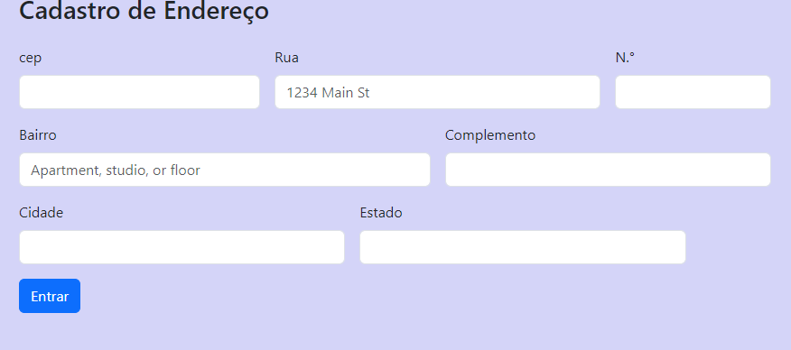

# Projeto de Cadastro de Endereço

## ``Descrição``
Este projeto feito durante as aulas de Programação Web I, este projeto consiste em um formulário web para cadastro de endereços. Ele utiliza Jvacript, HTML, CSS (com Bootstrap) e tem como objetivo facilitar a coleta de informações de endereços de forma estruturada e responsiva.

## ``Funcionalidades``

- **Limpeza do Formulário**: Antes de buscar um novo endereço, o formulário é limpo para evitar dados anteriores.
- **Validação de CEP**: O sistema verifica se o CEP informado possui 8 dígitos numéricos.
- **Preenchimento Automático**: Os campos do formulário são preenchidos automaticamente com os dados do endereço ao encontrar um CEP válido.
- **Tratamento de Erros**: O usuário é notificado caso o CEP não seja encontrado ou esteja incorreto.

## ``Como usar``

Abra o link [for.html](https://thaynaracarlo.github.io/form-CadEndereco/for.html) em um navegador web.
Digite um CEP válido no campo correspondente e pressione Tab ou clique fora do campo para ativar a pesquisa.
Os campos de endereço serão preenchidos automaticamente com os dados correspondentes ao CEP inserido.

## Imagens do site 

## GIf funcionamento do site:

## ``Formulário``
Coleta informações do usuário, como:
CEP, Rua, Número, Bairro, Complemento, Cidade, Estado
Botão de Submissão: Um botão estilizado para enviar os dados do formulário.

## ``Javascript``
* Função limparFormulario: 
Esta função limpa os campos do formulário, definindo seus valores como strings vazias. É útil para resetar o formulário antes de preencher novos dados.

* Função eNumero: 
Esta função verifica se a string numero contém apenas dígitos. Ela usa uma expressão regular (/^[0-9]+$/) para validar que a string consiste exclusivamente de números.

* Função cepValido:
Essa função verifica se o CEP é válido, confirmando que tem exatamente 8 caracteres e que todos são numéricos, utilizando a função eNumero

* Função preencherFormulario:
Esta função preenche os campos do formulário com os dados retornados da API de endereço, usando o objeto endereco.

* Função pesquisarCep:
Esta é a função principal que realiza a consulta do CEP:

* async: Indica que a função é assíncrona e pode usar await.
* limparFormulario(): Chama a função para limpar o formulário antes de buscar novos dados.
* fetch(url): Realiza uma requisição para a API ViaCep. A função await espera que a requisição seja concluída.
* dados.json(): Converte a resposta da API para um objeto JavaScript.
hasOwnProperty('erro'): Verifica se a resposta contém um erro (indicando que o CEP não foi encontrado).

## ``HTML``

* Um formulário simples que coleta informações de endereço.

* Campos para inserir o CEP, logradouro, número, complemento, bairro, cidade e estado.

* Um botão de submissão para enviar os dados.

## ``Tecnologias ultilizadas``
* HTML
* CSS
* JavaScript (E56)

## ``Referências``

* [ViaCep](https://viacep.com.br/)
* [bootstrap](https://getbootstrap.com/)

